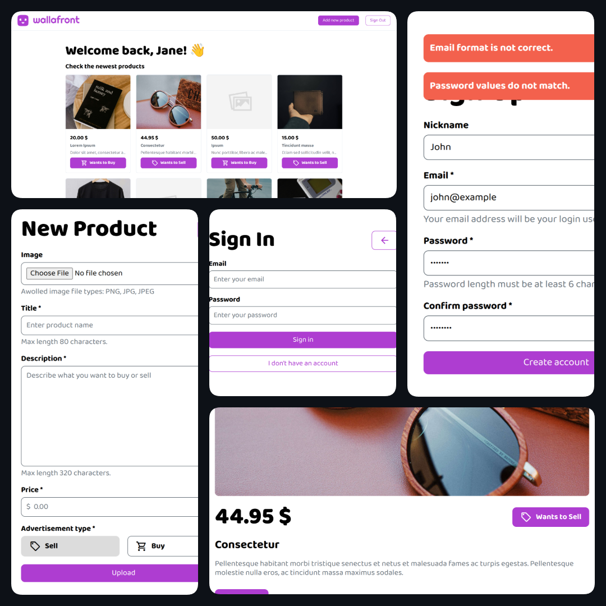

# Wallafront

Proyecto de práctica del módulo *Desarrollo Frontend con JavaScript* de **KeepCoding**.

## 📌 Tabla de contenidos

- [Descripción](#descripción)
- [Instalación](#instalación)
- [Uso](#uso)
- [Tecnologías y Prácticas Utilizadas](#tecnologías-utilizadas)
- [Capturas](#capturas)
- [Autor](#autor)

## Descripción

Aplicación web con el API REST [sparrest.js](https://github.com/kasappeal/sparrest), basada en [json-server](https://github.com/typicode/json-server), para servicios de compra y venta de artículos de segunda mano similar a Wallapop.

La pantalla principal muestra el listado de productos (independientemente de si el usuario ha iniciado sesión o no), que constan de precio, nombre, descripción y tipo de anuncio. Se gestionan los estados de listado vacío, carga pendiente y finalizada y error.

La app dispone de página de registro e identificación de usuarios con la correspondiente gestión de estados. En función de si el usuario ha hecho login y/o a proporcionado un nombre, la pantalla principal muestra un encabezado y menú de navegación distintos.

La página de creación de productos solo está disponibles para usuarios que hayan iniciado sesión. La imagen del artículo es opcional, se añade un placeholder en caso de no proporcionar una. Si la ruta de la imagen no es correcta o es borrada del directorio del API REST, se muestra un placeholder de image no encontrada.

Se permite acceder a los detalles de cada uno de los artículos, compuestos por nombre, precio, descripción, foto, tipo de anuncio, propietario y fecha de creación del anuncio. Si el usuario ha hecho login y es el propietario del anuncio, se muestra la opción de borrar el producto.

## Instalación 

Para instalar el proyecto en tu máquina, sigue los siguientes pasos:

1. Clona el repositorio del proyecto:
    ```bash
    git clone https://github.com/miguelferlez/keepcoding-practica-frontend.git
    ```

2. Clona el repositorio de sparrest.js:
    ```bash
    git clone https://github.com/kasappeal/sparrest.git
    ```

3. Navega hasta el directorio de sparrest.js o ejecuta el terminal en dicha ruta:
    ```bash
    cd Path/to/sparrest.js
    ```

4. Instala las dependencias del API REST:
    ```bash
    npm install
    ```

## Uso

Una vez completada la instalación, para hacer uso la app se deben seguir los siguientes pasos:

1. Mete el archivo del repositorio `db.json` en el directorio de sparrest.js

2. Inicia sparrest.js:
    ```bash
    npm start
    ```

3. Navega hasta el directorio del proyecto o ejecuta el terminal en dicha ruta:
    ```bash
    cd Path/to/keepcoding-practica-frontend
    ```

4. Inicia `live-server` en el repositorio del proyecto:
    ```bash
    npx live-server
    ```

5. En tu navegador, dirígete a [localhost:8080](http://localhost:8080).

## Tecnologías y Prácticas Utilizadas

- API REST
    - ✅ Fetch y manipulación de datos
    - ✅ LocalStorage, tokens y gestión de sesiones
- JavaScript
    - ✅ DOM dinámico
    - ✅ Events, listeners y gestión de estados de promesas
    - ✅ Arquitectura desacoplada en patrón MVC
    - ✅ Notificaciones personalizadas

## Capturas

</img>

## Autor

Miguel Fernández @miguelferlez
